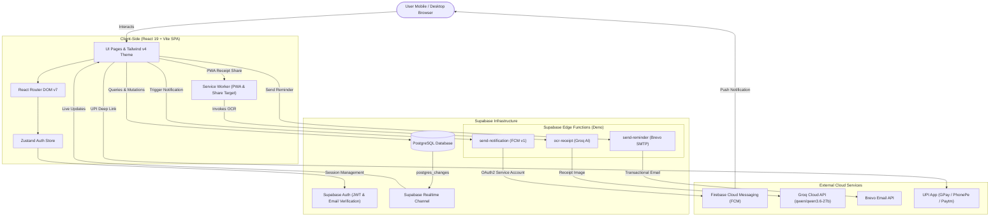

# Hisab Kitab (हिसाब किताब)

> **"Track money. Not misunderstandings."**  
> A full-featured, mobile-first Progressive Web Application (PWA) for managing personal finances, tracking shared expenses among friends with two-way confirmation, managing group kitty funds, and auto-logging UPI payment receipts using AI vision OCR.

---

## Table of Contents

1. [Project Overview](#1-project-overview)
2. [Key Features](#2-key-features)
3. [Technology Stack](#3-technology-stack)
4. [Application Architecture](#4-application-architecture)
5. [Project Structure](#5-project-structure)
6. [Prerequisites](#6-prerequisites)
7. [Local Development Setup](#7-local-development-setup)
8. [Environment Variables](#8-environment-variables)
9. [Supabase Backend & Edge Functions](#9-supabase-backend--edge-functions)
10. [Available Scripts](#10-available-scripts)
11. [Production Build](#11-production-build)
12. [Docker Deployment](#12-docker-deployment)
13. [Hosting & Platform Deployment](#13-hosting--platform-deployment)
14. [Troubleshooting](#14-troubleshooting)

---

## 1. Project Overview

**Hisab Kitab** is a personal and social finance manager tailored to the Indian financial workflow (UPI, shared flats, group kitties, and split bills). It solves the common friction points of shared money management:

- **Unilateral Tracking Mistakes:** Standard apps allow one party to unilaterally edit or delete debts. Hisab Kitab introduces a **two-way handshake**: when one person records an expense, the other must review and accept it. When a debt is paid, the creditor must confirm receipt.
- **Duplicate Prevention:** If Friend A claims "I paid ₹500 for Friend B", and Friend B simultaneously tries to enter "Friend A paid ₹500 for me", the app detects the reciprocal pending record and offers a one-tap acceptance instead of duplicating entries.
- **Instant Settlement:** Direct deep linking into India's Unified Payments Interface (`upi://pay`) allows debtors to settle directly via Google Pay, PhonePe, or Paytm with pre-filled amounts and payee identifiers.
- **Frictionless Expense Logging with AI OCR:** As an installed PWA, users can share a UPI payment confirmation screenshot straight from Android's system share sheet into Hisab Kitab. A Supabase Edge Function with Groq AI vision extracts the exact amount and payee details automatically.
- **Shared Group Funds:** Manages pooled cash and online accounts (e.g., house rent, party budgets, trip funds) with multi-holder balance tracking and role-based permissions (Owner, Admin, Member).

---

## 2. Key Features

### 🤝 Friend-to-Friend Transactions & Handshake
- **"You'll Get" / "You'll Pay" Dashboards:** Aggregated real-time balances showing net receivables and payables across all friends.
- **Two-Way Verification Workflow:**
  1. Creator logs a transaction (`pending_acceptance`).
  2. Counterparty receives a notification and accepts (`pending`) or rejects the transaction.
  3. Creator can edit or cancel while still pending acceptance.
- **Payment Verification:**
  - Debtor marks payment as paid (`payment_records`).
  - Creditor confirms receipt (reducing remaining balance or marking `settled`) or rejects invalid claims.
- **Reciprocal Match Detection:** Automatically warns if the other party already logged the counterpart transaction.

### 👥 Group Expenses & Bulk Transactions
- **Equal Splits:** Pay a total amount and split it equally across multiple friends in one operation.
- **Bulk Individual Records:** Add the same transaction amount individually to multiple friends (e.g., ticket purchases) without splitting.

### 🏦 Group Funds (Shared Kitty / Pool)
- **Multi-Holder Balances:** Track physical cash and online bank balances held by different group members.
- **Role-Based Access:** `owner`, `admin`, and `member` roles.
- **Fund Expense Logging:** Group admins/owners can log fund expenditures, automatically deducting from the respective holder's cash or online balance.
- **Audit History:** Full log of fund expenses, timestamps, and who recorded them.

### 📊 Personal Expense Tracker
- **Private Spending Records:** Categorized personal expense logging (Food, Shopping, Travel, Entertainment, Lunch, Dinner, Education, Other).
- **Payment Mode Tracking:** Categorize spending by Cash vs. Online.
- **Monthly Budget Summaries:** Previous/next month navigation with category-by-category breakdown and spend counts.
- **Data Export:** Export personal expense records directly to CSV.

### 📝 Personal Notes (Offline Contacts)
- Track money borrowed from or lent to offline contacts who are not registered on the platform, without sending notifications or requiring an account.

### ⚡ UPI Deep Link Integration
- One-tap settlement links (`upi://pay?pa=...&am=...`) using the friend's saved UPI ID. Automatically opens UPI apps (Google Pay, PhonePe, Paytm, BHIM) with recipient details pre-filled.

### 📸 PWA Web Share Target & AI Vision OCR
- **Web Share Target API:** Users can share UPI payment success screenshots directly to Hisab Kitab from mobile share sheets.
- **Service Worker Receipt Cache:** Intercepts `POST /share-target` multipart data in the service worker and caches the receipt image.
- **Groq Vision OCR:** Supabase Edge Function runs Qwen 3.6 27B vision model to extract exact transaction amount and merchant notes.

### 🔔 Notifications & Realtime Sync
- **Firebase Cloud Messaging (FCM):** Background and foreground push notifications for transaction requests, acceptances, rejections, and payment confirmations.
- **In-App Updates Center:** Notification bell with unread badge count and deep links to relevant transactions.
- **Supabase Realtime:** Immediate UI updates across connected devices using PostgreSQL Realtime channels (`friend_transactions`, `payment_records`, `notifications`).
- **Email Reminders:** Automated reminder emails sent via Brevo (Sendinblue) through edge functions.

---

## 3. Technology Stack

| Layer | Technology | Version | Purpose |
| :--- | :--- | :--- | :--- |
| **Frontend Framework** | React | `19.2.8` | Component-based user interface |
| **Language** | TypeScript | `~6.0.2` | Static typing and interfaces |
| **Build Tool & Bundler** | Vite | `^8.2.0` | High-speed build tooling and HMR |
| **Styling** | Tailwind CSS | `^4.3.3` | Utility-first CSS (Tailwind v4 with `@tailwindcss/vite`) |
| **Routing** | React Router DOM | `^7.18.2` | Client-side routing (SPA) |
| **State Management** | Zustand | `^5.0.15` | Global auth and session state |
| **Data Fetching** | TanStack Query | `^5.101.4` | Async state management |
| **Icons** | Lucide React | `^1.31.0` | Clean, modern iconography |
| **PWA & Offline** | `vite-plugin-pwa`, `workbox-precaching` | `^1.3.0` / `^7.4.1` | PWA manifest, service worker & Share Target |
| **Backend / DB / Auth** | Supabase (`@supabase/supabase-js`) | `^2.112.3` | PostgreSQL database, Auth, Storage, Realtime |
| **Push Notifications** | Firebase SDK | `^12.17.1` | Firebase Cloud Messaging (FCM) web push |
| **Edge Functions** | Deno (Supabase Edge) | `std@0.168.0` | Serverless functions for OCR, FCM, and Brevo email |
| **AI Vision Engine** | Groq Cloud (`qwen/qwen3.6-27b`) | API | Receipt OCR parsing |
| **Email Service** | Brevo (formerly Sendinblue) | REST API v3 | Automated reminder emails |
| **Linter** | Oxlint | `^1.75.0` | Fast Rust-based linter |
| **Containerization** | Docker & Nginx | Alpine 1.27 | Multi-stage Docker container & static web server |

---

## 4. Application Architecture

Hisab Kitab is built as a Single Page Application (SPA) powered by Vite, backed directly by Supabase for authentication, real-time data persistence, and serverless Edge Functions for third-party integrations (FCM, Groq, and Brevo).



---

## 5. Project Structure

```text
hisab-kitab/
├── public/                       # Static public assets
│   ├── favicon.svg               # Application favicon
│   ├── firebase-messaging-sw.js  # Background FCM service worker
│   ├── icon-192.png              # 192x192 PWA app icon
│   ├── icon-512.png              # 512x512 PWA splash icon
│   └── icons.svg                 # SVG sprite sheet
├── src/                          # Application source code
│   ├── assets/                   # Images and static assets
│   ├── components/               # Reusable UI components
│   │   ├── Avatar.tsx            # Initial-based user avatar
│   │   ├── Button.tsx            # Custom styled buttons (primary, secondary, danger, ghost)
│   │   ├── card.tsx              # Clean card surface component
│   │   └── EmptyState.tsx        # Placeholder display for empty list states
│   ├── lib/                      # Business logic, API calls, and clients
│   │   ├── auth.ts               # Supabase authentication helpers (signup, signin, reset)
│   │   ├── expenses.ts           # Personal expense CRUD and category aggregates
│   │   ├── exportCsv.ts          # Client-side CSV generation and download
│   │   ├── externalTransactions.ts# Personal Notes (offline tracking) logic
│   │   ├── firebase.ts           # Firebase push registration and token persistence
│   │   ├── friends.ts            # Friend requests, search (email/phone), and friendships
│   │   ├── groupFund.ts          # Group kitty funds, member roles, and balance deductions
│   │   ├── notify.ts             # Invocation helpers for email & push edge functions
│   │   ├── profile.ts            # Profile updates (Full Name, Phone, UPI ID)
│   │   ├── supabase.ts           # Supabase client initialization
│   │   ├── transactions.ts       # Friend transactions, splits, bulk adds, and payments
│   │   ├── updates.ts            # Notifications list and unread count queries
│   │   └── upi.ts                # UPI deep link generator (`upi://pay`)
│   ├── pages/                    # Route views
│   │   ├── auth/                 # Authentication screens
│   │   │   ├── ForgotPassword.tsx# Password reset request
│   │   │   ├── Login.tsx         # User login screen
│   │   │   ├── ResetPassword.tsx # New password setting screen
│   │   │   └── Signup.tsx        # Registration with email confirmation
│   │   ├── AddExpense.tsx        # Add personal expense (supports OCR pre-fill)
│   │   ├── AddFundExpense.tsx    # Record expenditure from a shared group fund
│   │   ├── AddTransaction.tsx    # Add 1:1 transaction, group split, bulk, or note
│   │   ├── BalanceBreakdown.tsx  # Detailed list of "You'll Get" / "You'll Pay" by friend
│   │   ├── Expenses.tsx          # Personal expenses dashboard with monthly filters
│   │   ├── FriendDetail.tsx      # Friend transaction thread, payment handshake & UPI
│   │   ├── Friends.tsx           # Friends list, friend requests, and user search
│   │   ├── FundMembers.tsx       # Member management for group funds
│   │   ├── GroupFund.tsx         # Group fund overview and holder balance breakdown
│   │   ├── GroupFundHistory.tsx  # Group fund spending history
│   │   ├── GroupFundsList.tsx    # Listing of all group funds user is part of
│   │   ├── LandingPage.tsx       # Public marketing landing page
│   │   ├── PersonalNotes.tsx     # Offline dues / personal notes management
│   │   ├── Profile.tsx           # User settings, UPI ID configuration, logout
│   │   ├── ShareTarget.tsx       # Web Share Target handler (parses receipt image via OCR)
│   │   └── Updates.tsx           # Notifications feed
│   ├── store/                    # Global state
│   │   └── authStore.ts          # Zustand store for user session and profile state
│   ├── types/                    # TypeScript interfaces
│   │   └── database.ts           # Database models (Profile, FriendTransaction, etc.)
│   ├── App.css                   # Component-level styles
│   ├── App.tsx                   # App router, bottom navigation, and auth listener
│   ├── index.css                 # Tailwind v4 import and custom color variables
│   ├── main.tsx                  # React DOM root entry point
│   └── sw.js                     # Custom service worker logic (Web Share Target cache)
├── supabase/                     # Supabase backend definitions
│   └── functions/                # Deno Edge Functions
│       ├── ocr-receipt/          # Groq vision OCR for UPI screenshots
│       ├── send-notification/    # FCM v1 HTTP API push notification sender
│       └── send-reminder/        # Brevo transactional email sender
├── .dockerignore                 # Docker build exclusions
├── .env.example                  # Environment variables template
├── .gitignore                    # Git file exclusions
├── .oxlintrc.json                # Oxlint linter rules
├── docker-compose.yml            # Docker Compose orchestration
├── Dockerfile                    # Production multi-stage Dockerfile
├── index.html                    # HTML entry point with PWA meta tags
├── nginx.conf                    # Nginx configuration for SPA routing & caching
├── package.json                  # NPM packages, dependencies, and scripts
├── tsconfig.json                 # TypeScript project configuration
├── vercel.json                   # Vercel deployment SPA rewrite rules
└── vite.config.ts                # Vite build config with Tailwind & PWA plugins
```

---

## 6. Prerequisites

To build and run Hisab Kitab locally, ensure you have:

- **Node.js**: Version `20.x` or `22.x` (LTS recommended; tested on Node `22.x` and `24.x`)
- **Package Manager**: `npm` (v10+ or v11+)
- **Git**: For version control
- **Supabase Account**: A Supabase project with database tables and auth enabled
- **Firebase Project (Optional)**: For web push notifications (FCM)
- **Docker & Docker Compose (Optional)**: If running via containerized deployment

---

## 7. Local Development Setup

### 1. Clone the repository

```bash
git clone <repository-url>
cd hisab-kitab
```

### 2. Install dependencies

```bash
npm install
```

### 3. Configure environment variables

Copy the example environment file:

```bash
cp .env.example .env
```

Open `.env` in your editor and provide your Supabase and Firebase keys (see [Environment Variables](#8-environment-variables) below).

### 4. Start the development server

```bash
npm run dev
```

The Vite development server will start at:
```text
http://localhost:5173
```

Open this URL in your web browser.

---

## 8. Environment Variables

Client-side environment variables in Vite must be prefixed with `VITE_` to be exposed to the client bundle.

### Frontend Client Variables (`.env`)

| Variable Name | Required | Description |
| :--- | :---: | :--- |
| `VITE_SUPABASE_URL` | **Yes** | The HTTPS URL of your Supabase project (e.g. `https://xyz.supabase.co`). |
| `VITE_SUPABASE_ANON_KEY` | **Yes** | The public anon / publishable key for your Supabase project. |
| `VITE_FIREBASE_API_KEY` | Optional | Firebase Web API key for push notification messaging. |
| `VITE_FIREBASE_AUTH_DOMAIN` | Optional | Firebase auth domain (e.g. `your-app.firebaseapp.com`). |
| `VITE_FIREBASE_PROJECT_ID` | Optional | Firebase Project ID. |
| `VITE_FIREBASE_STORAGE_BUCKET` | Optional | Firebase storage bucket domain. |
| `VITE_FIREBASE_MESSAGING_SENDER_ID` | Optional | Firebase Cloud Messaging Sender ID (numeric). |
| `VITE_FIREBASE_APP_ID` | Optional | Firebase Web Application ID. |
| `VITE_FIREBASE_VAPID_KEY` | Optional | Web Push VAPID public key generated in Firebase Console. |
| `PORT` | Optional | Port for Docker / Docker Compose host mapping (defaults to `3000`). |

> [!CAUTION]
> Never commit `.env` or `.env.local` files to version control. Keep `.env` listed in `.gitignore`.

### Supabase Edge Functions Secrets

The Supabase Edge Functions require their own secrets configured via the Supabase CLI (`supabase secrets set KEY=VALUE`) or Supabase Dashboard:

| Function | Secret Name | Purpose |
| :--- | :--- | :--- |
| `ocr-receipt` | `GROQ_API_KEY` | API key from Groq Cloud for vision inference (`qwen/qwen3.6-27b`). |
| `send-notification` | `SUPABASE_URL` | Supabase project API URL. |
| `send-notification` | `SUPABASE_SERVICE_ROLE_KEY` | Elevated service role key to query profiles and insert notifications. |
| `send-notification` | `FIREBASE_PROJECT_ID` | Firebase Project ID. |
| `send-notification` | `FIREBASE_CLIENT_EMAIL` | Google service account client email. |
| `send-notification` | `FIREBASE_PRIVATE_KEY` | Google service account private key. |
| `send-reminder` | `BREVO_API_KEY` | API Key for Brevo transactional email API. |
| `send-reminder` | `BREVO_SENDER_EMAIL` | Verified sender email address configured in Brevo. |

---

## 9. Supabase Backend & Edge Functions

### Database Tables Schema

The application relies on PostgreSQL tables with Row Level Security (RLS):

1. **`profiles`**: User profiles linked to `auth.users` (`id`, `full_name`, `email`, `phone`, `upi_id`, `avatar_url`, `fcm_token`, `created_at`).
2. **`friendships`**: Bilateral friendship relationships (`id`, `user_a`, `user_b`, `status`: `'pending' | 'accepted'`, `created_at`).
3. **`pending_invites`**: Records invitations sent to email addresses not yet registered on the platform.
4. **`friend_transactions`**: Ledger of friend debts and splits (`id`, `created_by`, `payer_id`, `payee_id`, `amount`, `remaining_amount`, `reason`, `category`, `status`: `'pending_acceptance' | 'pending' | 'partially_paid' | 'settled'`, `group_expense_id`, `created_at`, `updated_at`).
5. **`payment_records`**: Proof of payment claims during settlement handshake (`id`, `transaction_id`, `paid_by`, `amount`, `marked_paid_at`, `confirmed`, `confirmed_at`, `rejected`, `rejected_at`).
6. **`group_expenses`**: Parent record for multi-party group split expenses (`id`, `created_by`, `total_amount`, `reason`, `category`, `created_at`).
7. **`group_funds`**: Shared money pools/kitties (`id`, `name`, `created_by`, `created_at`).
8. **`group_fund_members`**: Membership and permissions in a fund (`id`, `fund_id`, `user_id`, `role`: `'owner' | 'admin' | 'member'`).
9. **`group_fund_balances`**: Live cash and online balance breakdown held per member (`id`, `fund_id`, `user_id`, `cash_balance`, `online_balance`, `updated_at`).
10. **`group_fund_transactions`**: Expenditures deducted from group funds (`id`, `fund_id`, `amount`, `reason`, `category`, `added_by`, `holder_id`, `payment_mode`, `created_at`).
11. **`personal_expenses`**: Private personal spending records (`id`, `user_id`, `amount`, `category`, `note`, `spent_on`, `payment_mode`, `created_at`).
12. **`external_transactions`**: Personal Notes for offline contacts (`id`, `user_id`, `contact_name`, `amount`, `remaining_amount`, `direction`: `'they_owe_me' | 'i_owe_them'`, `reason`, `status`: `'pending' | 'settled'`).
13. **`notifications`**: In-app notifications history (`id`, `user_id`, `title`, `body`, `type`, `read`, `action_url`, `created_at`).

### Authentication
- Built on **Supabase Auth** with email and password.
- Verification emails redirect back to `${window.location.origin}/` to establish the authenticated session.
- Password reset flows via `/forgot-password` and `/reset-password`.

### Realtime Channels
The frontend subscribes to PostgreSQL CDC events using `supabase.channel(...)`:
- `dashboard-updates`: Listens to changes on `friend_transactions` and insertions on `notifications`.
- `friend-detail-${friendId}`: Listens to updates on `friend_transactions` and `payment_records` for immediate settlement feedback.

---

## 10. Available Scripts

All scripts are configured in `package.json`:

```bash
# Run local development server with Hot Module Replacement (HMR)
npm run dev

# Run TypeScript compiler typecheck and compile production Vite bundle into dist/
npm run build

# Run Oxlint for fast code analysis
npm run lint

# Preview the built production dist/ directory locally
npm run preview
```

---

## 11. Production Build

To build the static production bundle locally:

```bash
npm run build
```

This compiles:
- Static assets into `dist/` (HTML, JS, CSS, PWA manifest, service worker).
- Optimized, minified JavaScript and CSS.
- PWA Workbox manifest and service workers (`dist/sw.js`, `dist/registerSW.js`).

To test the compiled production build locally before deployment:

```bash
npm run preview
```

The preview server will be accessible at:
```text
http://localhost:4173
```

---

## 12. Docker Deployment

Hisab Kitab includes a multi-stage `Dockerfile` and a `docker-compose.yml` for running the application in a lightweight production container.

### How the Docker Build Works
1. **Builder Stage (`node:22-alpine`):**
   - Copies `package.json` and `package-lock.json` and runs `npm ci`.
   - Injects the `VITE_*` build arguments (since Vite statically bundles environment variables at build time).
   - Compiles the application via `npm run build`.
2. **Runner Stage (`nginx:1.27-alpine`):**
   - Copies the compiled `/app/dist` into Nginx's web root (`/usr/share/nginx/html`).
   - Copies `nginx.conf` with Single Page Application (SPA) fallback routing (`try_files $uri $uri/ /index.html;`), gzip compression, and security headers.
   - Resulting image is small (~25–35 MB).

### Running with Docker Compose (Recommended)

1. Make sure your `.env` file exists with your Supabase credentials:
   ```bash
   cp .env.example .env
   # Edit .env and enter your VITE_SUPABASE_URL and VITE_SUPABASE_ANON_KEY
   ```

2. Build and start the container:
   ```bash
   docker compose up --build -d
   ```

3. Open your browser at:
   ```text
   http://localhost:3000
   ```
   *(or the port specified by `PORT` in your `.env`)*

4. To stop the container:
   ```bash
   docker compose down
   ```

### Running with Docker CLI Directly

1. Build the Docker image with your Supabase credentials:
   ```bash
   docker build \
     --build-arg VITE_SUPABASE_URL="https://your-project.supabase.co" \
     --build-arg VITE_SUPABASE_ANON_KEY="your-anon-key" \
     -t hisab-kitab .
   ```

2. Run the container:
   ```bash
   docker run -d -p 3000:80 --name hisab-kitab-app hisab-kitab
   ```

3. Access the application at `http://localhost:3000`.

---

## 13. Hosting & Platform Deployment

### Vercel Deployment

The project includes `vercel.json` configured for Single Page Applications:

```json
{
  "rewrites": [
    { "source": "/(.*)", "destination": "/index.html" }
  ]
}
```

To deploy on Vercel:
1. Connect your repository to Vercel.
2. Set the framework preset to **Vite**.
3. Set the build command to `npm run build` and output directory to `dist`.
4. Add the environment variables (`VITE_SUPABASE_URL`, `VITE_SUPABASE_ANON_KEY`, and `VITE_FIREBASE_*`) in **Project Settings > Environment Variables**.
5. Deploy.

---

## 14. Troubleshooting

### 1. `Missing Supabase env vars` Error on Startup
- **Cause:** `src/lib/supabase.ts` throws an error if `VITE_SUPABASE_URL` or `VITE_SUPABASE_ANON_KEY` is not present at build time.
- **Fix:** Ensure `.env` is created before running `npm run dev` or `npm run build`. For Docker builds, pass the variables using `--build-arg` or run via `docker compose` with a configured `.env` file.

### 2. 404 Errors on Page Refresh (e.g. `/friends`, `/expenses`)
- **Cause:** Because Hisab Kitab uses `react-router-dom` for client-side routing, standard web servers will attempt to find a literal file path unless configured with an SPA fallback.
- **Fix:** 
  - In Docker, this is already resolved by `nginx.conf` using `try_files $uri $uri/ /index.html;`.
  - On Vercel, this is already resolved by `vercel.json` rewrite rules.
  - If deploying to other hosts (Apache, Netlify, Cloudflare Pages), configure routing rules to direct all traffic to `index.html`.

### 3. PWA Web Share Target & Push Notifications Not Working
- **Cause:** The Web Share Target API and Web Push Notifications require a secure HTTPS context or `localhost`.
- **Fix:** In production, ensure SSL/TLS certificates (HTTPS) are active on your domain. Grant notification permissions when prompted in the browser.

### 4. UPI Deep Link Doesn't Open on Desktop
- **Cause:** The `upi://pay` protocol requires a registered UPI handler application (e.g. Google Pay, PhonePe, Paytm), which are typically only installed on mobile devices (Android/iOS).
- **Fix:** Open Hisab Kitab on a smartphone or install it as a PWA on your mobile device to test UPI settlement links.

---

## License

This project is proprietary and private. All rights reserved.
